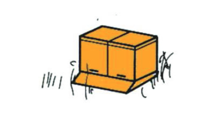

# Generation 21 - Basiskurs 1
## Imkerverein Eckental-Heroldsberg

TODO: Logo besorgen

---

## Inhalte
* Standortwahl
* Aufstellsysteme
* Bienenbeschaffung
* Betriebsmittel
* Arbeitsmittel
* Dokumentation
* Rechtliches

---

## Standortwahl
### Die Lage im Gelände

--

Hier mal exemplarisch ein "idealer" Standort

--

### Echte "don't" Kriterien
* Kaltluftseen
* Nordausrichtung
* dauerhaft harten Schatten

--

### Die Trachtsituation
Bienen benötigen 
* Wasser  
stehende Gewässer
* Pollen  
z.B. im Frühjahr: Weiden, Hasel, Erle  
z.B. im Spätsommer: Senf, Ölrettich
* Nektar
* Kittharz 

--

### Sonstiges
## Standortwahl
### Sonstiges
* Konkurrenz
* Anfahrtmöglichkeiten
* Publikumsverkehr
* Nachbarn
* Schutzgebiete
* Sperrgebiete <!-- .element: class="fragment" style="color:red" -->

---

## Aufstellsysteme

--

### Bienenhaus
<!-- .element class="r-strech " -->

--

### Bienenhaus
* Wetter geschütztes Arbeiten
* Schutz vor Störungen
* ortsfest
* schwieriges Hantieren mit Beuten (z.B. Kippen etc)
* Baugenehmigung erforderlich

--

### Freistand
<!-- .element class="r-strech"  -->

--

### Freistand
* Mischung aus Bienenhaus und Freiaufstellung
* Kein seitliches Arbeiten
* schwieriges Hantieren mit Beuten (z.B. Kippen etc)

--

### Freiaufstellung
<!-- .element class="r-strech"  -->

--

### Freiaufstellung
#### Einzelaufstellung
<!-- .element class="r-strech" width="15%" -->
* Hoher Platzbedarf
* Seitliches Arbeiten möglich
* Kein Verflug
* Kippen möglich

--

### Freiaufstellung
#### Zweieraufstellung
<!-- .element class="r-strech" width="15%" -->
* Seitliches Arbeiten möglich
* Kippen möglich

--

### Freiaufstellung
#### 4er Block
<!-- .element class="r-strech" width="15%" -->
* Seitliches Arbeiten möglich
* geringer Verflug
* Gemeinsamer stabiler Unterbau

--

### Freiaufstellung
#### Reihenaufstellung
<!-- .element class="r-strech" width="15%" -->
* Seitliches Arbeiten am Rand möglich
* Kippen möglich
* Gemeinsamer stabiler Unterbau
* Verflug stärker

---

## Bienenbeschaffung
Der Anfang ist das schwerste ;)

--

## Bienenbeschaffung
### "Gute" Erstbezugsquellen
* Imkerverein
* Bienenmärkte/Bienenbörsen
* Schwarmfang

--

## Bienenbeschaffung
### do not ever do <!-- .element: style="color:red" -->
* "Importbienen" z.B. aus Italien (kleiner Beutenkäfer) <!-- .element: class="fragment" style="color:red" -->
* Bienen aus Sperrgebieten <!-- .element: class="fragment" style="color:red" -->

--

## Bienenbeschaffung
### Tips beim Bienenkauf
* Gesundheitszeugnis
* Wenn möglich selbst Zustand prüfen auf zumindest offensichtliche Krankheiten

<!-- .element class="r-strech"  -->

---

## Betriebsmittel

--

## Betriebsmittel
### Die Beute 

Live Vorstellung beim Vorbereiten der Beuten (24.4.21)

Achtet bitte darauf, zu diesem Termin alles zusammen zu haben.

Wir nutzen als Typ/Maß: Dadant US
--
### Aufbau einer Dadant Beute
  <!-- .element class="r-strech" width="35%" -->  
(Copyright Holtermann-shop.de)

--

### Mittelwände
Mittelwände sind Wachsplatten, die die Wabenstruktur bereits vorgeprägt haben
***
* Dadant US Brut und Honig Mittelwände
* Arbeiterinnen Zellen (5,4mm)

--

### Mittelwände
#### Qualitätskriterien

* Erzeugerqualität:
    * Normal
    * Bio

* Belastung:  
    * Normale
    * Rückstandsarm
    * Rückstandsfrei
    * Sonstige "Zusätze" (z.B. Parafine)<!-- .element: class="fragment" style="color:red" -->

---
## Arbeitsgeräte
### Stockmeißel  

--

## Arbeitsgeräte
### Smoker und Rauchstoff
 <!-- .element width="25%" -->

--

## Arbeitsgeräte
### Bienenbesen
 <!-- .element width="50%" -->

--

## Arbeitsgeräte
### Sonstiges
* Schutzanzug
* Wassersprüher
* Rähmchenspanner
* Spanngurte
* Medikamente und deren Applikatoren
* etc.

---

## Dokumentation
### Die Stockkarte

* "Freies" Format
* Eigendokumentation über den Zustand der Völker
  * Varroa, Gewichte, allgemeiner Zustand etc.
  * Behandlungen mit Medikamenten

--
#### Eine Beispiel-Stockkarte
<!-- .element class="r-strech" width="35%" -->

---

## Rechtliches

--
### Privatrecht (BGB)
Betrifft z.B. 
* Abstände zu Nachbarn
* Schwarmrecht
* Haftpflichtfall

--

### Baurecht (BayBO und BauGB)
Kommt primär bei Bienenhäusern zum tragen

--

### Tierseuchenrecht (Bienenseuchenverordnung)
* Meldung der Standorte beim Veterinär
* Anzeigepflicht bei Seuchen (Faulbrut, Kleiner Beutenkäfer etc.)

--

### Arzneimittelrecht
* Führung eines Bestandsbuches
* Zulässigkeit von Medikamenten und deren Anwendung

--

### Lebensmittelrecht 
* Lebensmittelhygieneverordnung
* Lebensmittel- und Futtermittelgesetzbuch
* Honigverordnung  

--

### Sonstige Verordnungen & Normen

* Verbraucherrecht
* Steuerrecht
* Gewerberecht

### Eure Betriebsnummer
Ja, ihr seid als Imker offiziell Landwirte und braucht eine Betriebsnummer

---

# Danke ;)

---

## Diskussionsrunde
